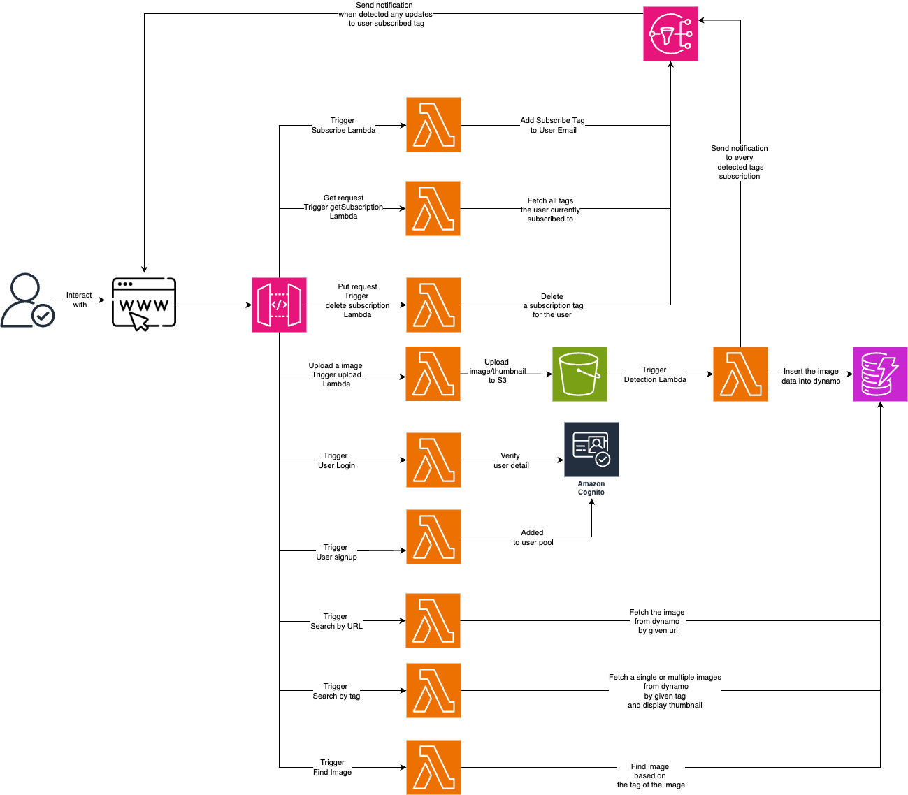

# PixTag: An AWS-powered Serverless Image Storage System

## Project Overview

PixTag is an AWS-based online system that allows users to upload images and perform object detection. The detected tags and image information are stored in DynamoDB. Users can query for specific images by tag, search for images based on tags, update or delete tags in DynamoDB, and subscribe to specific tags. When an image with a subscribed tag is added or updated, users receive email notifications. The application leverages AWS services such as S3, Lambda, API Gateway, DynamoDB, and SNS to provide a seamless experience for image management and retrieval.

## Features

- Upload images to S3 and automatically generate tags using object detection(yolo).
- Store image metadata and tags in DynamoDB.
- Query images based on tags via API Gateway.
- Subscribe to specific tags to receive notifications when new images with those tags are added.
- Simple user interface for image upload, query, and viewing results.
- User authtication using AWS Cognito

## System Diagram

Here is the system diagram:

## Technologies Used

- **AWS S3**: Storage for images.
- **AWS Lambda**: Serverless functions used to perform the main logic
- **AWS API Gateway**: RESTful API endpoints for all queries.
- **AWS DynamoDB**: Database for storing image metadata and tags.
- **AWS SNS**: Notification service for tag-based subscriptions.
- **OpenCV**: Library for creating image thumbnails added as a layer in lambda.
- **Yolo-tiny-config**: Image processing model added as a layer in lambda.

## Team
- Team51 Memeber: Jingyan LOU, Yanqi Zhu, Jinhui Li
